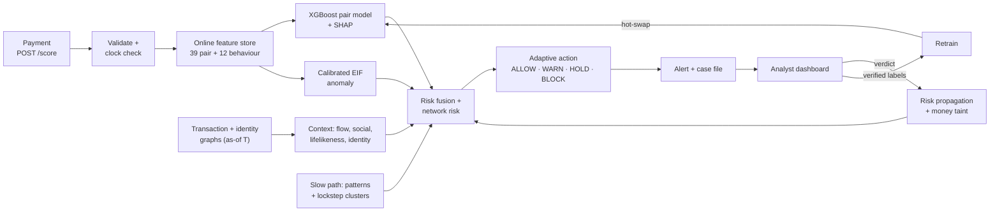

<div align="center">

# 🔗 RingBreaker

**Real-time fraud-ring detection for peer-to-peer payments.**

Scores every payment as a *sender → receiver pair* before the money moves, explains each alert with its own evidence, and learns from analyst verdicts.


</div>

---

## Why RingBreaker

Mule networks and fraud rings hide in plain sight: each individual payment looks ordinary, but the *shape* of the money gives them away. Account-level scoring misses that shape, and rule engines flood analysts with look-alike false positives such as households sharing a device, rent collectors and trip splits.

RingBreaker treats the **pair** and the **network** as the unit of risk:

- **Pair-level ML**: an XGBoost model scores the sender–receiver relationship from 39 pair and 12 behavioural features.
- **Graph evidence**: transaction and identity graphs with strict *as-of* queries, so scoring never sees the future.
- **Named pattern detection**: loops, chains, fan-in and shared-device stars, found on a rolling slow path.
- **Lockstep detection**: clusters of accounts that sign up, move and pay in unison, flagged days before they cash out.
- **Anomaly fusion**: a calibrated Extended Isolation Forest catches what supervised models have not seen.
- **Human in the loop**: analyst verdicts propagate risk through the network, taint laundered money, and feed retraining.

## Results

Evaluated on a **held-out stream of 11,199 payments** (95 fraudulent, across 50+ planted rings, including ring families never seen in training). The held-out stream is never used for training, calibration or threshold selection.

| Metric | Result |
| --- | --- |
| Fraud recall at the alert threshold | **73.7%** |
| Alert precision | **77.8%** |
| Precision of BLOCK decisions | **95.7%** |
| False-positive rate on ordinary payments | **0.18%** |
| False-positive rate on honest look-alike groups | **0.0%** |
| Recall on novel ring families | **74.0%** |
| Sleeper-ring lead time (lockstep flagged before bust-out) | **~123 hours** |
| Scoring latency (p50 / p95) | **2.3 ms / 2.6 ms** |

Recall rises to 77.9% after a single analyst confirmation propagates risk through the network.

## Architecture



One Python process (FastAPI plus an in-memory engine) and one React dashboard. There is no database, queue or cache. See [docs/ARCHITECTURE.md](docs/ARCHITECTURE.md) for the full end-to-end walk-through of a payment.

### How a payment is scored

1. **Validate** ids, amount and timestamp; reject out-of-order payments so features can never leak the future.
2. **Compute features** as of the payment time, using the same code online and offline, so there is no training/serving skew.
3. **Score** with the XGBoost pair model (with per-feature SHAP) and the EIF anomaly model.
4. **Add context**: receiver lifelikeness and pass-through behaviour, pair social plausibility, shared identity, plus the latest patterns and lockstep clusters.
5. **Fuse** `0.60·pair + 0.25·anomaly + 0.15·lockstep`, calibrate on the validation slice, then combine with network risk from confirmed accounts.
6. **Act**: `ALLOW` below 0.30, `BLOCK` at 0.70 and above, and in between `HOLD_RECEIVER` or `WARN_SENDER` depending on which sub-score dominates.
7. **Explain**: every alert carries an evidence subgraph, a 14-day timeline, detected patterns with roles, SHAP factors and a counterfactual.

## Features

| Area | Capability |
| --- | --- |
| **Detection** | Pair model, anomaly model, lockstep clusters, loop / chain / fan-in / star patterns |
| **Graphs** | Transaction and identity graphs with as-of queries, graph metrics, personalised PageRank propagation |
| **Explainability** | SHAP factors, counterfactual amount search, evidence subgraph, role-labelled patterns, plain-language summary |
| **Decisioning** | Adaptive actions (allow, warn sender, hold receiver, block) with calibrated thresholds |
| **Analyst loop** | Confirm or clear alerts, risk spread to connected accounts (~50 ms), money-taint tracking |
| **Learning** | Retrain on verified labels with before/after metrics at the alert threshold |
| **Streaming** | Replay engine with adjustable speed that auto-pauses on every BLOCK |
| **Dashboard** | Overview, Alerts, Investigation, Network, Patterns, Accounts and Learning views |
| **Simulation** | Synthetic population with personas, honest look-alikes, label noise and six ring families plus held-out novel ones |
| **Ops** | Dockerfile for Cloud Run, gzip responses, OpenAPI docs, end-to-end smoke test |

### Fraud ring families covered

Loop · Chain · Fan-in · Shared-device star · Scam collection · Sleeper bust-out · Novel (held-out) families

## Quick start

Requires **Python ≥ 3.10** and **Node ≥ 18**.

```bash
git clone https://github.com/GuY-Gits/RingBreaker.git
cd RingBreaker

make setup      # virtualenv + backend + dashboard dependencies
make demo       # build the dashboard and serve everything on :8001
```

Open <http://127.0.0.1:8001/app>. Interactive API docs are at `/docs`.

Generated data and trained models ship with the repository, so no training is needed. To rebuild everything (about 40 s):

```bash
make data       # simulate → features → XGBoost → EIF → backfill → held-out evaluation
```

For frontend development with hot reload, run `make api` and `make dashboard` in two terminals and open <http://localhost:5173/app>.

### Docker

```bash
docker build -t ringbreaker .
docker run -p 8080:8080 ringbreaker      # http://localhost:8080/app
```

The image builds the dashboard and serves it from the API, and honours Cloud Run's `$PORT`.

## Using the console

1. **Overview**: history is pre-scored. Pick a stream speed and press **Start stream** to replay the held-out payments live.
2. **Alerts**: the queue fills as rings act. The stream pauses automatically on each BLOCK.
3. **Investigation**: open a case to see the decision and reasons, the evidence graph, patterns, timeline, SHAP factors, counterfactual and party profiles.
4. **Verdict**: confirm fraud or clear a false positive. A confirmation spreads risk to connected accounts and shows a before → after table.
5. **Patterns**: watch lockstep clusters surface days ahead of a sleeper ring's bust-out.
6. **Learning**: retrain on verified labels and compare before → after metrics.

The reset button in the top bar rewinds everything.

## API

The same routes are served at `/` and under `/api`.

| Method | Route | Purpose |
| --- | --- | --- |
| `POST` | `/score` | Score a payment and return risk, action and reasons |
| `POST` | `/accounts` | Register an account |
| `GET` | `/alerts`, `/alerts/{id}` | List alerts; fetch a full case file |
| `POST` | `/alerts/{id}/verdict` | Confirm or clear an alert |
| `GET` | `/graph/snapshot` | Evidence subgraph for a case or account |
| `GET` | `/overview`, `/payments/recent` | Dashboard summary and live payment feed |
| `GET` | `/accounts`, `/accounts/{id}` | Risky accounts and account profiles |
| `GET` | `/patterns` | Detected rings and lockstep clusters |
| `GET` | `/learning` | Model metrics and retrain history |
| `POST` | `/admin/retrain` | Retrain with verified labels |
| `GET/POST` | `/stream/status`, `start`, `pause`, `config`, `step`, `reset` | Stream replay control |
| `GET` | `/health` | Liveness check |

## Project layout

```
ringbreaker/
  engine/        runtime engine, risk fusion, case files, stream replay
  api/           FastAPI app
  features/      online feature store: flow, social, lifelike, lockstep
  graphs/        transaction + identity graphs with as-of queries
  patterns/      loop, chain, fan-in, shared-device star
  anomaly/       calibrated Extended Isolation Forest
  scoring/       action policy and fusion weights
  explain/       counterfactual search
  learn/         retraining on verified labels
  simulator/     synthetic users, payments and planted rings
  pipeline.py    one-command data + model build
  evaluate.py    held-out evaluation
dashboard/       React + TypeScript + D3 analyst console
tests/           temporal-leakage, API-contract and detector tests
scripts/         end-to-end smoke test
docs/            architecture and simulator design
experiments/     IEEE-CIS benchmark of the modelling approach
```

## Testing

```bash
make test        # pytest (backend) + tsc + vitest (dashboard)
make smoke       # HTTP end-to-end journey against a running API
```

The suite includes dedicated **temporal-leakage tests** that verify no feature ever reads data from after the payment being scored.

## Configuration

| Variable | Default | Purpose |
| --- | --- | --- |
| `RINGBREAKER_DATA_DIR` | `ringbreaker/data` | Simulator CSVs |
| `RINGBREAKER_MODELS_DIR` | `ringbreaker/models` | Models, metadata, evaluation |
| `RINGBREAKER_SLOW_PATH_EVERY` | `50` | Payments between slow-path runs |
| `RINGBREAKER_CORS_ORIGINS` | `http://localhost:5173,…` | Dev-server origins |
| `RINGBREAKER_DASHBOARD_DIST` | `dashboard/dist` | Built dashboard location |

No secrets are required. The demo has no authentication, so do not expose it publicly without a gateway in front.

## Tech stack

**Backend**: Python, FastAPI, Pydantic, NetworkX, pandas, NumPy, scikit-learn, XGBoost
**Frontend**: React, React Router, TypeScript, D3, Vite, Vitest
**Delivery**: Docker multi-stage build, Google Cloud Run

## License

See [NOTICE](NOTICE) for attribution and design references.
