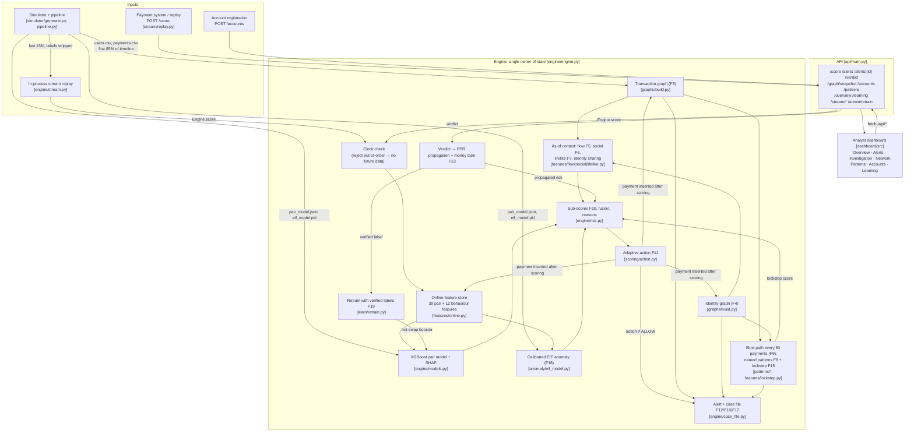

# RingBreaker architecture

One Python process (FastAPI + an in-memory engine) and one React dashboard.
No database, queue or cache: the PRD's "in-memory Python dicts and NetworkX"
storage is enough for the demo's data size.

## Runtime data flow

Every arrow below is a real call in the code (file names in brackets).

## One payment, end to end

`Engine.score` in `ringbreaker/engine/engine.py`:

1. **Validate**: ids, finite amount in (0, 1e9], ISO timestamp, sender ≠ receiver.
2. **Clock check**: a payment older than the last processed one returns 409.
   The feature store is incremental, so this rule is what guarantees features
   never include later payments.
3. **Features as of T**: `OnlineFeatureState.pair_features` (39) and
   `behaviour_features` (12) from history strictly before this payment. Offline
   training uses the same class (`features/pair_features.py`), so there is no
   training/serving skew.
4. **Models**: XGBoost fraud probability with per-feature SHAP; EIF anomaly as a
   percentile of training scores.
5. **Context**: receiver lifelikeness (F7) and pass-through (F5), pair social
   plausibility (F6), identity sharing (F4), and patterns and lockstep from the
   latest slow path, all as of T.
6. **Fusion + calibration**: `0.60·pair + 0.25·anomaly + 0.15·lockstep`, mapped
   through thresholds fitted on the validation slice (no held-out data): the
   alert cut-off maximises F1 against the recorded validation labels (about
   0.5% of payments alert), and the top 0.2% block. Then
   noisy-OR with network risk: 1.0 for analyst-confirmed accounts, 0.5 × the
   propagated risk of other accounts.
7. **Action (F11)**: `< 0.30` ALLOW, `≥ 0.70` BLOCK. Between the two, the
   dominant sub-score picks the action: a mule-like receiver gives
   HOLD_RECEIVER; odd sender behaviour or an implausible payee gives
   WARN_SENDER.
8. **Insert** the payment into both graphs and the feature store. Taint
   follows laundering: a confirmed account moving ≥ ₹1,000, or a tainted
   account forwarding within 6 h, passes 80% of its risk to the receiver.
9. **Alert** if the action isn't ALLOW. The case file is assembled on request
   from stored facts: the evidence subgraph, 14-day timeline, patterns with
   roles, SHAP factors, counterfactual (the amount search re-runs the model) and
   a template summary.
10. **Slow path** every 50 payments: loops, chains, fan-in and shared-device
    stars over the last 7 days, and lockstep clusters (DBSCAN + signup cohorts,
    scored on compactness, rhythm, internal payments and shared identity),
    all as of the stream clock.

## Historical backfill

`python -m ringbreaker.backfill` (part of `make data`) replays the training and
validation periods through `Engine.score` once and caches the scores and alerts
in `models/history_backfill.json.gz`. At start-up the engine attaches them to
the pre-stream payments (`period="history"`), so the dashboard opens populated;
the live stream then plays only the held-back 15%. The cache is keyed on the
data, the pair model and the calibration, and is ignored if any of them change.
Historical scores are in-sample for the pair model (trained on the first 70%)
and are never part of `evaluate.py` or retrain metrics.

## Analyst loop

- **Confirm** (`POST /alerts/{id}/verdict`): the selected accounts (default:
  receiver + ring members, excluding a likely scam-victim sender) become
  confirmed fraud. Personalized PageRank over the payment ∪ shared-identity
  graph spreads risk to connected accounts (≈ 25–50 ms). The response lists
  every before → after change. The payment becomes a verified label.
- **Clear**: closes the alert and stores a verified genuine label. Nothing is
  propagated.
- **Retrain** (`POST /admin/retrain`): pre-stream history + verified labels
  (weighted ×5) → new XGBoost, evaluated on unverified held-out payments, then
  hot-swapped as the live model.

## Temporal correctness

| Where | Guarantee | Test |
| --- | --- | --- |
| Online feature store | features for payment k are identical with or without later payments | `tests/test_online_features.py` |
| Engine | out-of-order and duplicate payments rejected; candidate not in its own features | `tests/test_online_features.py` |
| Batch vs online | same code, identical values | `tests/test_online_features.py` |
| Graph queries, flow, social, lifelike, lockstep, patterns | `as_of` filters | `tests/test_temporal_leakage.py`, `tests/test_lockstep.py` |
| Split | 70/15/15 on the **timeline**; stream rows carry no labels | `ringbreaker/split.py` |
| Identity links | visible from their earliest observation time only | `graphs/build.py` indexes |

The old API loaded `anomaly_scores.csv` and `lockstep_scores.csv`, which were
computed over the whole dataset including future payments. That path is gone:
anomaly is computed per payment and lockstep as of the stream clock.

## Measured results (held-out stream through the live engine)

`python -m ringbreaker.evaluate` → `ringbreaker/models/evaluation.json`

Simulator v2 data: 5,000 accounts, ~47,000 payments, 58 rings in 8 families
(2 families appear only in the held-out stream, with fresh accounts), ~100
benign look-alike groups and 10% label noise. Held-out stream: 11,199 payments,
95 fraud.

| | No analyst action | After one confirmation |
| --- | --- | --- |
| Precision / recall | 77.8% / 73.7% | 45.1% / 77.9% |
| False-positive rate | 0.18% | 0.81% |
| Block-tier precision (blocked payments) | 95.7% (47) | 62.1% (87) |
| Novel-family recall (never in training) | 74% | 74% |
| Benign look-alike flag rate | 0.0% | 0.0% |
| Sleeper ring flagged before bust-out | 123 h | 123 h |
| Fast path p50 / p95 | 2.3 / 2.6 ms | 2.3 / 2.7 ms |

Held-out pair-model PR-AUC 0.81 (base rate 0.85%).

Confirmation reach: the suggested seeds were 7/7 real ring accounts;
afterwards 26 more ring accounts and 31 other accounts crossed 30% risk (the
latter mostly counterparties of the confirmed mules). Payment-level labels
count a confirmed mule's everyday payments as genuine, which is why precision
(alert and block tier) drops after a confirmation; on new cases (payments not
involving a confirmed account) precision is 50.4%, recall 75.0%.

The alert cut-off was chosen on validation only (best F1 there: 0.51 against
the noisy recorded labels); the figures above are what that choice gives on
the held-out stream.

Weakest families: mule chains (2/4 held-out payments), closed loops (8/12),
the synthetic sleeper (6/9) and the novel distributed-device ring (22/31).
Slow chains mostly evade the named-pattern detector; the pair model still
flags 15/19 of their payments.

## Module map

| Path | Role |
| --- | --- |
| `ringbreaker/engine/` | engine, risk fusion, case files, models, stream |
| `ringbreaker/api/main.py` | HTTP layer and dashboard hosting |
| `ringbreaker/features/online.py` | shared online feature store |
| `ringbreaker/features/{flow,social,lifelike,lockstep}.py` | F5, F6, F7, F15 |
| `ringbreaker/graphs/build.py` | F3/F4 graphs with `as_of` queries |
| `ringbreaker/patterns/` | F8 detectors |
| `ringbreaker/scoring/` | action policy, fusion weights |
| `ringbreaker/learn/retrain.py` | F19 |
| `ringbreaker/pipeline.py`, `evaluate.py`, `split.py` | build, metrics, time split |
| `ringbreaker/{bandit,sequence,embeddings,redteam}/` | P2 offline experiments, not on the runtime path; rerun them after regenerating data |
